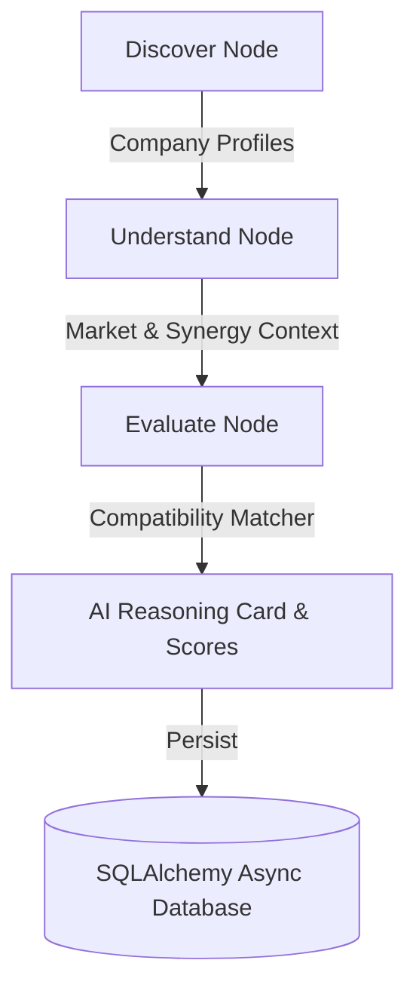

# 🌐 Orbit — Autonomous AI Partnership Development Representative (AI PDR)

**Orbit** is an autonomous AI agent designed to discover, evaluate, and orchestrate B2B SaaS technology partnerships. Acting as an intelligent AI PDR, Orbit analyzes SaaS company pairs, evaluates strategic compatibility, generates transparent AI Reasoning Cards, and manages end-to-end partnership pipelines.

---

## ✨ Features

- **🎯 Dual SaaS Compatibility Matcher**: Evaluates strategic fit between any two SaaS companies, calculating quantitative Compatibility Scores (0–100) and Confidence metrics.
- **🧠 Structured AI Reasoning Cards**: Replaces black-box AI scores with full explainability (*Why this company?*, *Why now?*, *Why this decision maker?*, *Why this partnership?*, *Why outreach strategy?*, and *Suggested next action*).
- **⚡ Modular LLM Provider Architecture**: Pluggable backend (`BaseLLMProvider`) supporting OpenAI, Anthropic, Gemini, or zero-dependency mock providers for offline testing.
- **🔄 LangGraph Workflow Orchestration**: Multi-node agentic workflow graph (`Discover` → `Understand` → `Evaluate`) managing structured state transitions.
- **🗄️ Robust Partnership Domain & Persistence**: Async SQLAlchemy ORM (`PartnerCompany`, `PartnershipOpportunity`) with PostgreSQL & SQLite fallback support.

---

## 🏗️ Architecture & Workflow



### Workflow Stages
1. **Discover**: Scrapes or loads profiles for Company A and Target Company B.
2. **Understand**: Extracts developer platform data, API specs, and joint market synergy context.
3. **Evaluate**: Executes `CompatibilityMatcher` to generate compatibility scores, integration opportunities, and structured `AIReasoningCard`.

---

## 🛠️ Project Structure

```text
orbit/
├── backend/
│   ├── app/
│   │   ├── compatibility/       # Core Matcher, Reasoning Card & LLM Providers
│   │   ├── graph/               # LangGraph state definition, nodes & compiler
│   │   ├── partnerships/        # Partnership domain schemas, repository & service
│   │   ├── shared/              # Config, Async DB connection & ORM models
│   │   └── main.py              # FastAPI Application Entry Point
├── tests/
│   └── test_end_to_end_mvp.py   # End-to-end MVP intelligence pipeline test
├── .env.example
├── .gitignore
└── README.md
```

---

## 🚀 Getting Started

### Prerequisites
- **Python 3.11+**
- **pip** package manager

### 1. Installation
Clone the repository and set up a virtual environment:

```bash
git clone https://github.com/dhruvil-codes/orbit.git
cd orbit
python -m venv venv
# On Windows:
venv\Scripts\activate
# On macOS/Linux:
source venv/bin/activate
```

Install backend dependencies:

```bash
pip install -r backend/requirements.txt
# Or install core runtime dependencies:
pip install fastapi uvicorn sqlalchemy aiosqlite pydantic pydantic-settings langgraph openai
```

### 2. Environment Configuration
Copy `.env.example` to `.env`:

```bash
cp .env.example .env
```

*(Optional)* Set your `OPENAI_API_KEY` in `.env` to enable live LLM evaluation, or leave blank to run using the built-in deterministic provider.

---

## 🧪 Running the End-to-End MVP Test

Verify Orbit's intelligence pipeline locally by analyzing a sample SaaS partnership (**Notion x Linear**):

```bash
python tests/test_end_to_end_mvp.py
```

### Example Output:
```text
=======================================================
  ORBIT DAY 3 END-TO-END MVP PIPELINE EXECUTION SUCCESS  
=======================================================

  Partnership Opportunity ID : ca587b2c-fa04-425a-aaba-910d2e49bb7c
  Opportunity Title          : Notion & Linear Product Intelligence Partnership
  Compatibility Score        : 87.5 / 100
  Confidence Score           : 92.0 / 100
  Status                     : evaluated

STRUCTURED AI REASONING CARD:
  - Why This Company?        : Linear dominates the enterprise workflow segment...
  - Why Now?                 : Both Notion and Linear recently updated public APIs...
  - Why Decision Maker?      : Head of Technical Partnerships at Linear...
  - Why Partnership?        : Combining Notion intelligence with Linear platform...
  - Why Outreach Strategy?   : Value-first technical demo highlighting API POC...
  - Suggested Next Action    : Approve automated outreach draft...
```

---

## 📡 Running the FastAPI Backend

Start the API development server:

```bash
cd backend
uvicorn app.main:app --reload
```

Access the interactive API documentation at `http://localhost:8000/docs`.

---

## 📄 License

Distributed under the MIT License. See `LICENSE` for details.
